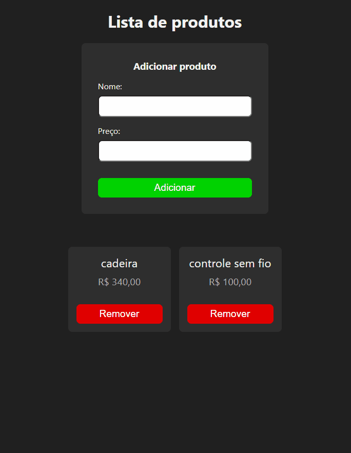

# desafio-http-react



> Esse projeto foi desenvolvido durante o curso de ReactJs do Matheus Battisti, onde foi estudado os conceitos de requisições HTTP

## ⚙️ Pré-requisitos

- Node
- Git

## 🚀 Baixando

Para baixar, siga estas etapas:

Linux, macOS ou Windows:

```
git clone https://github.com/devCleidison/desafio-http-react.git
```

ou baixe o arquivo compactado diretamente pelo link:

```
https://codeload.github.com/devCleidison/desafio-http-react/zip/refs/heads/main
```

## ☕ Instalando as dependências

```
yarn ou npm
```

## 🚀 Executando back-end

```
yarn server ou npm server
```

## 🚀 Executando front-end

```
yarn start ou npm start
```


[⬆ Voltar ao topo](#desafio-http-react)<br>